# 📚 Adding RAG to your n8n Chatbot

In the last guide we gave our chatbot tools. It could fetch real weather data. But it still had one problem. It could only answer from what the AI already knew. It had no access to our own documents or private knowledge.

This guide fixes that. We build a **RAG chatbot** a chatbot that reads your own files and answers questions from them.

---

> *Note: This guide covers RAG at a practical level inside n8n. We will go much deeper into RAG concepts chunking strategies, embedding models, similarity search, reranking, and evaluation in the upcoming **LangChain series**. Think of this as your first hands-on introduction before the deep dive.*

---

## Table of Contents

1. [What is the problem we are fixing?](#what-is-the-problem-we-are-fixing)
2. [What is RAG?](#what-is-rag)
3. [RAG components](#rag-components)
4. [The Complete Workflow](#the-complete-workflow)
5. [Flow 1 Load Data Flow](#flow-1-load-data-flow)
6. [Flow 2 Retriever Flow](#flow-2-retriever-flow)
7. [The knowledge files we loaded](#the-knowledge-files-we-loaded)
8. [How it all connects](#how-it-all-connects)
9. [Word List](#word-list)
10. [Whats Next](#whats-next)

---

## What is the problem we are fixing?

The old chatbot could only answer from what the AI model already knew during training. Ask it about your own documents, your company policies, or specific medical files you wrote it had no idea.

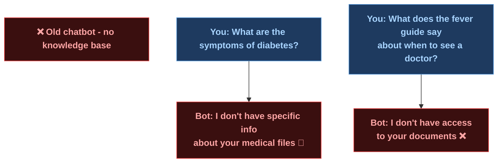

The new chatbot reads your own files and answers from them directly.

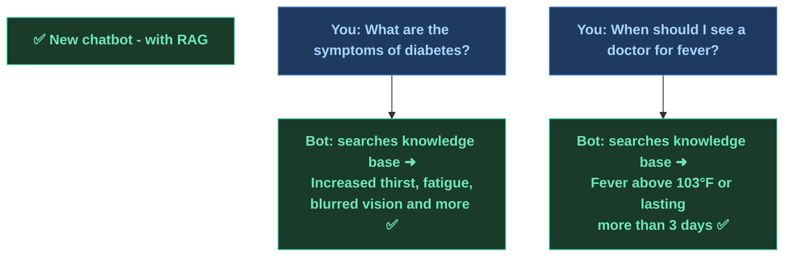

---

## What is RAG?

RAG stands for **Retrieval Augmented Generation**. It is a way of giving the AI access to your own documents at query time.

Instead of relying on what the model learned during training, RAG lets the AI search through your files, find the most relevant pieces, and use them to answer your question.

Think of it like this. Without RAG the AI is answering from memory. With RAG the AI is answering from a library of your own documents that it can search through every time you ask something.

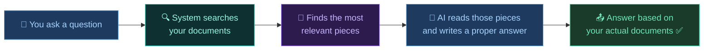

---

## RAG components

Every RAG system has the same four building blocks no matter what tool you use.

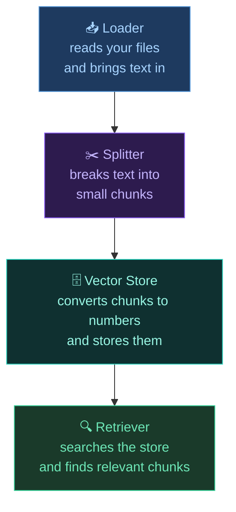

| Component | What it does |
|-----------|-------------|
| Loader | reads your files and extracts the raw text |
| Splitter | breaks that text into smaller chunks so the AI can search it precisely |
| Vector Store | converts each chunk into numbers called embeddings and stores them |
| Retriever | when you ask a question it finds the most similar chunks and returns them |

---

## The Complete Workflow

This workflow has two separate flows on the same canvas.

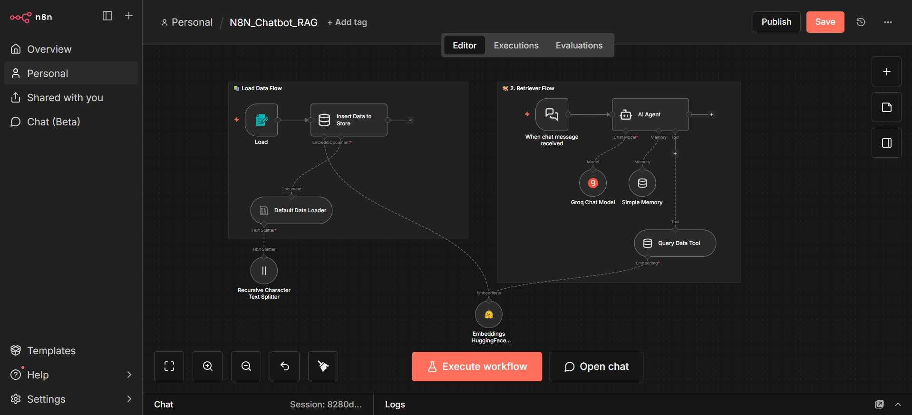

**Load Data Flow** on the left this is where you upload your files. It runs once to load documents into the vector store.

**Retriever Flow** on the right this is the actual chatbot. Every time you ask a question it searches the vector store and answers from what it finds.

The two flows share the same **Vector Store** and the same **Embeddings model**. That is what connects them.

---

## Flow 1 Load Data Flow

This flow runs once when you want to load new documents. It has three nodes working together.

### Node 1 Load — Form Trigger

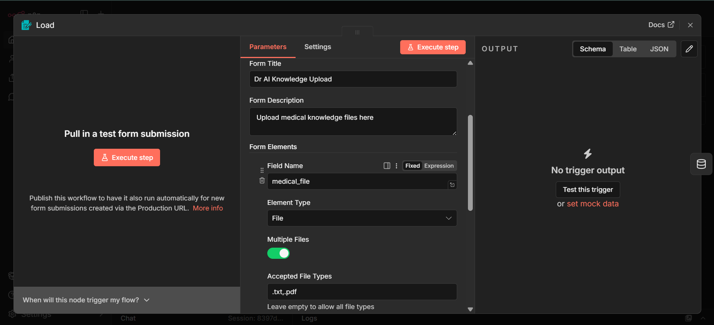

This is a **Form Trigger**. It opens a web form where you can upload files. You go to the form URL, upload your `.txt` or `.pdf` file, and submit. That submission triggers the rest of the flow automatically.

| Setting | Value | What it means |
|---------|-------|--------------|
| Form Title | Dr AI Knowledge Upload | the title shown on the upload form |
| Field Name | medical_file | the name of the file input field |
| Element Type | File | it accepts file uploads not text |
| Multiple Files | ON | you can upload more than one file at once |
| Accepted File Types | .txt, .pdf | only these formats are allowed |

### Node 2 Default Data Loader

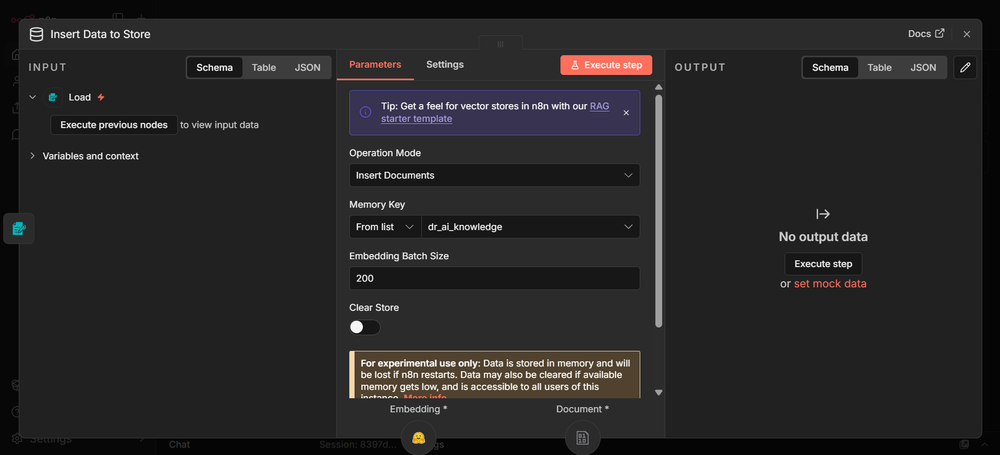

This node takes the uploaded file and reads the text out of it. It sits between the Load trigger and the Vector Store.

| Setting | Value | What it means |
|---------|-------|--------------|
| Type of Data | Binary | the file comes in as raw binary data from the form |
| Mode | Load All Input Data | reads everything from the uploaded file |
| Data Format | Text | treats the file content as plain text |
| Text Splitting | Custom | uses our own splitter node instead of the built in one |

At the bottom you can see a **Text Splitter** connector. This is where the Recursive Character Text Splitter plugs in.

The **Recursive Character Text Splitter** is not shown in a separate screenshot but it connects here with these settings: Chunk Size 500 and Chunk Overlap 200. This means it cuts the text into pieces of 500 characters each, with 200 characters overlapping between chunks. The overlap makes sure important information at the boundary between two chunks is not lost.

### Node 3 Insert Data to Store — Vector Store

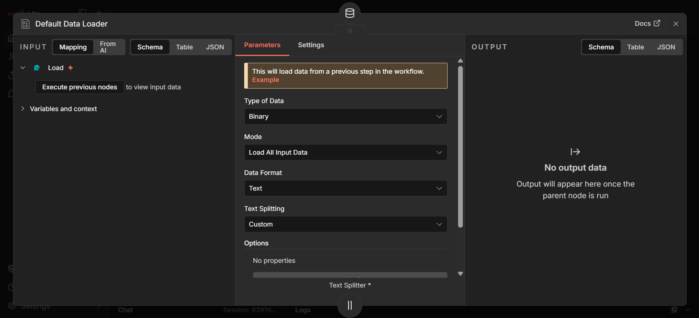

This is the **In-Memory Vector Store** in Insert mode. It takes the chunks from the loader and converts them into embeddings then stores them.

| Setting | Value | What it means |
|---------|-------|--------------|
| Operation Mode | Insert Documents | we are putting data in, not searching |
| Memory Key | dr_ai_knowledge | the name of this vector store. both flows use this same key |
| Embedding Batch Size | 200 | converts 200 chunks at a time into embeddings |
| Clear Store | OFF | keeps existing data. turn on if you want to start fresh |

The orange warning at the bottom says this is experimental and data is lost if n8n restarts. For production use you would switch to Postgres or another persistent store.

---

## Flow 2 Retriever Flow

This is the chatbot. It runs every time you send a message.

### Embeddings HuggingFace Inference

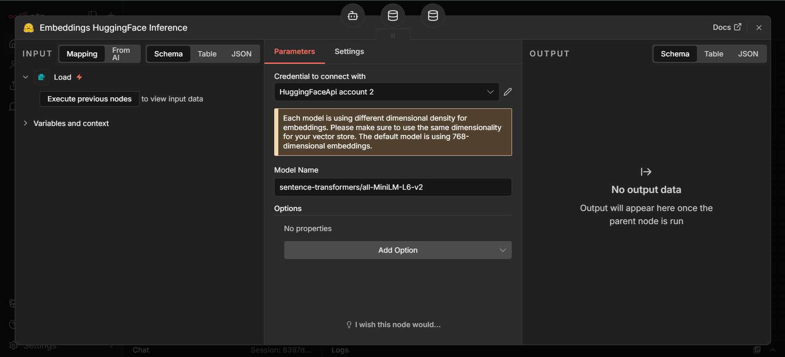

This node converts text into numbers called embeddings. It is used by both flows when loading documents to store them, and when searching to find similar ones.

| Setting | Value | What it means |
|---------|-------|--------------|
| Credential | HuggingFaceApi account 2 | your HuggingFace API key |
| Model Name | sentence-transformers/all-MiniLM-L6-v2 | a lightweight model that converts text to 384-dimensional vectors |

To get a HuggingFace API key go to [huggingface.co](https://huggingface.co), sign up for free, go to Settings then Access Tokens, and create a new token. Paste it into n8n as a new HuggingFace credential.

The same model must be used for both storing and searching. If you store with one model and search with another the numbers will not match and nothing will be found.

### Query Data Tool — Vector Store Retriever

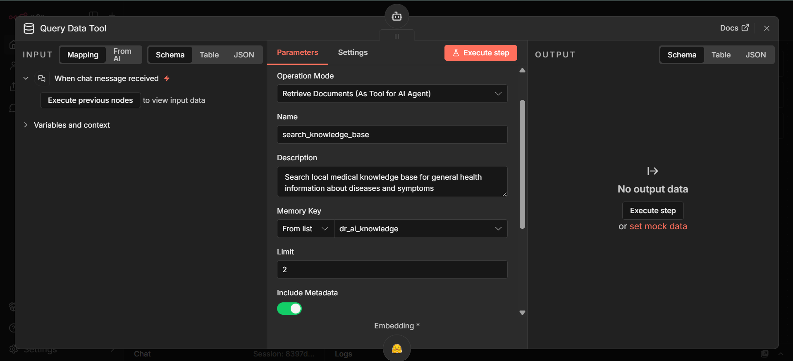

This is the same Vector Store but in **Retrieve as Tool** mode. It becomes a tool the AI Agent can call when it needs to search the knowledge base.

| Setting | Value | What it means |
|---------|-------|--------------|
| Operation Mode | Retrieve Documents As Tool | the AI Agent can call this like a tool |
| Name | search_knowledge_base | the tool name the AI uses to call it |
| Description | Search local medical knowledge base for general health information | the AI reads this to decide when to use the tool |
| Memory Key | dr_ai_knowledge | must match the key used in Insert mode |
| Limit | 2 | returns the top 2 most similar chunks |
| Include Metadata | ON | returns extra info about where each chunk came from |

The **AI Agent** in this flow has a system message that tells it to use `search_knowledge_base` for health questions and answer naturally like a real doctor. It also has Groq Chat Model and Simple Memory connected just like the previous guides.

---

## The knowledge files we loaded

We loaded two text files into the knowledge base.

**diabetes.txt** covers what diabetes is, the three types (Type 1, Type 2, Gestational), common symptoms like increased thirst and fatigue, risk factors, lifestyle tips, complications if untreated, and when to see a doctor.

**fever.txt** covers what fever is, normal body temperature, home remedies, and exactly when to see a doctor fever above 103°F, lasting more than 3 days, or with serious symptoms like difficulty breathing or severe headache.

These files were uploaded through the Load form, split into chunks, converted to embeddings, and stored in the `dr_ai_knowledge` vector store. Now the chatbot can search them.

---

## How it all connects

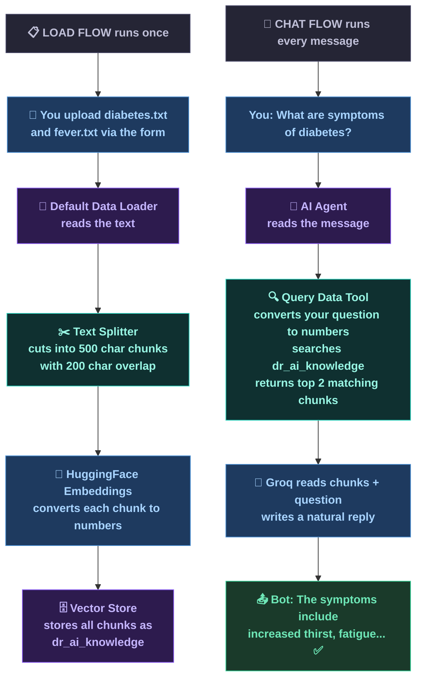

---

## Word List

| Word | Simple meaning |
|------|--------------|
| RAG | Retrieval Augmented Generation. giving the AI access to your own documents at query time |
| Loader | reads your files and extracts the raw text |
| Splitter | breaks text into smaller chunks |
| Chunk | one small piece of text cut from a larger document |
| Chunk Size | how many characters each chunk contains. set to 500 here |
| Chunk Overlap | how many characters two neighboring chunks share. set to 200 here |
| Embedding | a list of numbers that represents the meaning of a piece of text |
| Vector Store | a database that stores embeddings and lets you search them by similarity |
| Memory Key | the name of a vector store. both flows must use the same key |
| Retriever | searches the vector store and returns the most similar chunks |
| HuggingFace | a platform that hosts free embedding models |
| sentence-transformers/all-MiniLM-L6-v2 | the embedding model used. converts text to 384-dimensional vectors |
| Retrieve as Tool | a vector store mode that lets the AI Agent call it like a tool |
| Form Trigger | a node that opens a web form to receive file uploads |
| Insert Documents | vector store mode for storing new data |
| Top K | how many results the retriever returns. set to 2 here |

---

## Whats Next

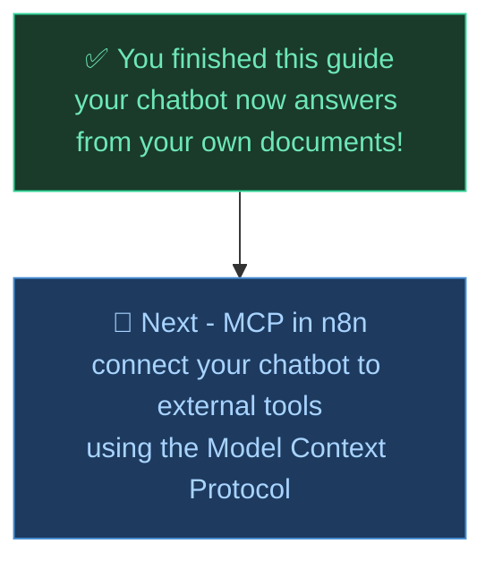

---

*Made by Abdul Samad*
